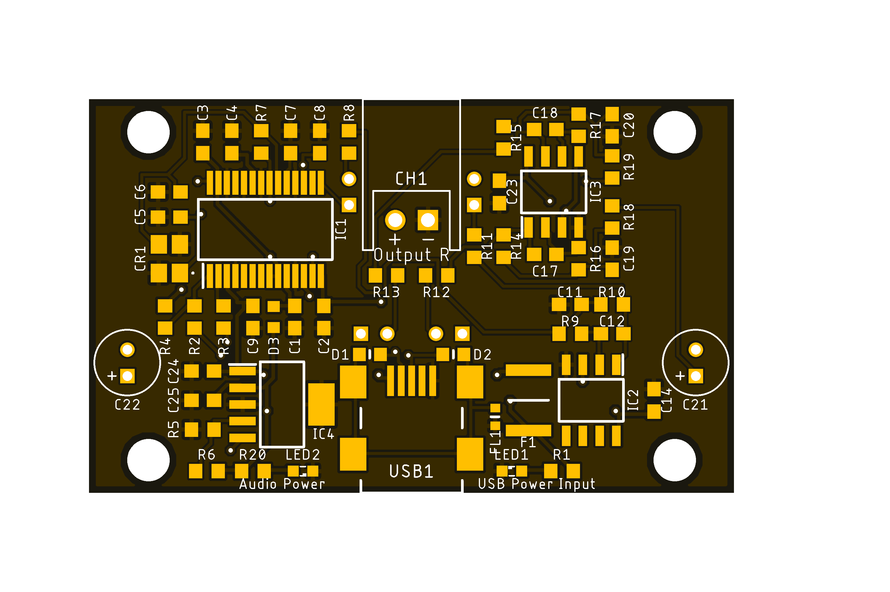

<html lang="en">
  <head>
    <meta charset="uft-8">
    <meta name="author" content="Masato Kubotera">
  </head>
  <body>
    <h1>USB-Audio Ver. 1.0</h1>
    <h2>About USB-Audio</h2>
    

      USB-Audio is the USB device for audio input/output via a USB interface.
        
      <h3>About Ver. 1.0</h3>
      Ver 1.0 has one port for speaker output and two condenser microphones. Since it does not have a speaker, it must be connected via a 2-pin XH connector if necessary.  
      The device is used by connecting it to a PC with a USB Mini-B cable. 
      The outputs have 0 dB attenuation and the inputs have 3.5 -dB attenuation.
      Each input and output has an "MFB LP filter".
        
      <!--
      -->
      <table>
        <tr>
          <td>
            <a href="image/brd_top.png">
              

                
              

            </a>
          </td>
          <td>
            

              
            

          </td>
        </tr>
        <tr>
          <td>
            

              PCB preview image
            

          </td>
          <td>
            

              After component mounting
            

          </td>    
        </tr>
      </table>
    

    <h2>Repository Contents</h2>
    

    <dl>
      <dt>\image</dt>
      <dd>PCB preview images and capture of design screen</dd>
      <dt>\libraries</dt>
      <dd>Libraries used in Autodesk Eagle design</dd>
      <dt>Schematic.pdf</dt>
      <dd>Circuit diagram of this product</dd>
      <dt>BOM.txt</dt>
      <dd>Parts lists output from design data</dd>
      <dt>.brd</dt>
      <dd>Board wiring design file by Autodesk Eagle</dd>
      <dt>.sch</dt>
      <dd>Schematic design file by Autodesk Eagle</dd>
      <dt>Gerber_data.zip</dt>
      <dd>Zip folder of Gerber format files for PCB manufacturing requests.</dd>
      <dt>LICENSE</dt>
      <dd>This is a license to use this product. Please confirm before use.</dd>
      <dt>.gitignore</dt>
      <dd>File to exclude cache files from management.</dd>
    </dl>
    

    <h2>Documentation</h2>
      

        <h3>BOM</h3>
          <table>
            <thead>
              <tr>
                <th> Eagle Design Parts # </th>
                <th> Q'ty </th>
                <th> Mfr. Product # </th>
                <th> Supplier </th>
                <th> Description </th>
              </tr>
            </thead>
              <tr>
                <td>C1, C2, C3, C4, C7, C8, C9, C25</td>
                <td>8</td>
                <td>GRM188R71E105KA12</td>
                <td><a href="https://akizukidenshi.com/catalog/g/gP-14526/">Akizuki</a></td>
                <td>Multilayer Ceramic Capacitors SMD/SMT 1uF 25V 10% 0603</td>
              </tr>
              <tr>
                <td>C10, C13, C15, C16, C21, C22</td>
                <td>6</td>
                <td>UMW1V100MDD</td>
                <td><a href="https://akizukidenshi.com/catalog/g/gP-08377/">Akizuki</a></td>
                <td>Aluminum Electrolytic Capacitors - Radial Leaded 35volts 10uF 85c 5x5 2LS</td>
              </tr>
              <tr>
                <td>C11, C19, C20</td>
                <td>3</td>
                <td>GCD188R71H182KA01J</td>
                <td><a href="https://www.mouser.jp/ProductDetail/81-GCD188R71H182KA1J">Mouser</a></td>
                <td>Multilayer Ceramic Capacitors SMD/SMT 1800pF 50V 10% 0603</td>
              </tr>
              <tr>
                <td>C12, C17, C18</td>
                <td>3</td>
                <td>GRM1882C1H331JA01</td>
                <td><a href="https://akizukidenshi.com/catalog/g/gP-09254/">Akizuki</a></td>
                <td>Multilayer Ceramic Capacitors SMD/SMT 330pF 50V 5% 0603</td>
              </tr>
              <tr>
                <td>C14, C23</td>
                <td>2</td>
                <td>GRM188R6YA106MA73</td>
                <td><a href="https://akizukidenshi.com/catalog/g/gP-13161/">Akizuki</a></td>
                <td>Multilayer Ceramic Capacitors SMD/SMT 10uF 35V 20% 0603</td>
              </tr>
              <tr>
                <td>C24</td>
                <td>1</td>
                <td>GCM188L81H104K57</td>
                <td><a href="https://akizukidenshi.com/catalog/g/gP-16143/">Akizuki</a></td>
                <td>Multilayer Ceramic Capacitors SMD/SMT 0.1uF 50V 10% 0603</td>
              </tr>
              <tr>
                <td>C5, C6</td>
                <td>2</td>
                <td>C1608C0G1H220J080AA</td>
                <td><a href="https://www.mouser.jp/ProductDetail/810-C1608C0G1H220J">Mouser</a></td>
                <td>Multilayer Ceramic Capacitors SMD/SMT 22pF 50V 5% 0603</td>
              </tr>
              <tr>
                <td>CH1</td>
                <td>1</td>
                <td>S2B-XH-A(LF)(SN)</td>
                <td><a href="https://akizukidenshi.com/catalog/g/gC-12262/">Akizuki</a></td>
                <td>Connector Header Through Hole, Side entry 2 position 2.5mm</td>
              </tr>
              <tr>
                <td>CR1</td>
                <td>1</td>
                <td>FA-238V 12.0000MB-K3</td>
                <td><a href="https://akizukidenshi.com/catalog/g/gP-05225/">Akizuki</a></td>
                <td>Crystals 12.0000MHz 50ppm 10pF -40C +85C</td>
              </tr>
              <tr>
                <td>D1, D2</td>
                <td>2</td>
                <td>CG0603MLC-05E</td>
                <td><a href="https://www.mouser.jp/ProductDetail/652-CG0603MLC-05E">Mouser</a></td>
                <td>ESD Protectors 5V 0603</td>
              </tr>
              <tr>
                <td>D3</td>
                <td>1</td>
                <td>RB520SM-30T2R</td>
                <td><a href="https://www.mouser.jp/ProductDetail/755-RB520SM-30T2R">Mouser</a></td>
                <td>Schottky Diodes & Rectifiers Diode Schottky 30V 0.2A</td>
              </tr>
              <tr>
                <td>F1</td>
                <td>1</td>
                <td>MF-MSMF050-2</td>
                <td><a href="https://www.mouser.jp/ProductDetail/652-MF-MSMF050-2">Mouser</a></td>
                <td>PTC Resettable Fuses 15V .5A-HD 100A MAX</td>
              </tr>
              <tr>
                <td>FL1</td>
                <td>1</td>
                <td>BLM18SD220SN1D</td>
                <td><a href="https://www.mouser.jp/ProductDetail/81-BLM18SD220SN1D">Mouser</a></td>
                <td>Ferrite Beads 22 OHM 0603</td>
              </tr>
              <tr>
                <td>IC1</td>
                <td>1</td>
                <td>PCM2904DB</td>
                <td><a href="https://www.mouser.jp/ProductDetail/595-PCM2904DB">Mouser</a></td>
                <td>Interface - CODECs Ster Codec with USB Ifc Sngl-end I/O</td>
              </tr>
              <tr>
                <td>IC2, IC3</td>
                <td>2</td>
                <td>OPA2353UA</td>
                <td><a href="https://www.mouser.jp/ProductDetail/595-OPA2353UA">Mouser</a></td>
                <td>High Speed Operational Amplifiers Hi-Spd Single-Sply Rail-to-Rail</td>
              </tr>
              <tr>
                <td>IC4</td>
                <td>1</td>
                <td>REG103GA-AG4</td>
                <td><a href="https://www.mouser.jp/ProductDetail/595-REG103GA-AG4">Mouser</a></td>
                <td>LDO Voltage Regulators DMOS 500mA LDO Reg</td>
              </tr>
              <tr>
                <td>LED1, LED2</td>
                <td>2</td>
                <td>150060VS86000</td>
                <td><a href="https://www.mouser.jp/ProductDetail/710-150060VS86000">Mouser</a></td>
                <td>Standard LEDs - SMD Green 2V 20mA 573nm 0603</td>
              </tr>
              <tr>
                <td>MIC1, MIC2</td>
                <td>2</td>
                <td>C9767BB422LFP</td>
                <td><a href="https://akizukidenshi.com/catalog/g/gP-01810/">Akizuki</a></td>
                <td>2-wire Electret Condenser Microphone</td>
              </tr>
              <tr>
                <td>R1, R20</td>
                <td>2</td>
                <td>RC0603FR-101KL</td>
                <td><a href="https://www.mouser.jp/ProductDetail/603-RC0603FR-101KL">Mouser</a></td>
                <td>Thick Film Resistors - SMD 1 kOhms 100-200mW 1% 0603</td>
              </tr>
              <tr>
                <td>R11, R12, R13</td>
                <td>3</td>
                <td>RC0603FR-10100RL</td>
                <td><a href="https://www.mouser.jp/ProductDetail/603-RC0603FR-10100RL">Mouser</a></td>
                <td>Thick Film Resistors - SMD 100 Ohms 100-200mW 1% 0603</td>
              </tr>
              <tr>
                <td>R18, R19</td>
                <td>2</td>
                <td>RC0603FR-1018KL</td>
                <td><a href="https://www.mouser.jp/ProductDetail/603-RC0603FR-1018KL">Mouser</a></td>
                <td>Thick Film Resistors - SMD 18 kOhms 100-200mW 1% 0603</td>
              </tr>
              <tr>
                <td>R2, R3</td>
                <td>2</td>
                <td>RC0603FR-1022RL</td>
                <td><a href="https://www.mouser.jp/ProductDetail/603-RC0603FR-1022RL">Mouser</a></td>
                <td>Thick Film Resistors - SMD 22 Ohms 100-200mW 1% 0603</td>
              </tr>
              <tr>
                <td>R4</td>
                <td>1</td>
                <td>RC0603FR-101K5L</td>
                <td><a href="https://www.mouser.jp/ProductDetail/603-RC0603FR-101K5L">Mouser</a></td>
                <td>Thick Film Resistors - SMD 1.5 kOhms 100-200mW 1% 0603</td>
              </tr>
              <tr>
                <td>R5</td>
                <td>1</td>
                <td>RC0603FR-1313KL</td>
                <td><a href="https://www.mouser.jp/ProductDetail/603-RC0603FR-1313KL">Mouser</a></td>
                <td>Thick Film Resistors - SMD 13 kOhms 100-200mW 1% 0603</td>
              </tr>
              <tr>
                <td>R6</td>
                <td>1</td>
                <td>RC0603FR-1027KL</td>
                <td><a href="https://www.mouser.jp/ProductDetail/603-RC0603FR-1027KL">Mouser</a></td>
                <td>Thick Film Resistors - SMD 27 kOhms 100-200mW 1% 0603</td>
              </tr>
              <tr>
                <td>R7</td>
                <td>1</td>
                <td>RC0603FR-101ML</td>
                <td><a href="https://www.mouser.jp/ProductDetail/603-RC0603FR-101ML">Mouser</a></td>
                <td>Thick Film Resistors - SMD 1 MOhms 100-200mW 1% 0603</td>
              </tr>
              <tr>
                <td>R8, R10, R14, R15</td>
                <td>4</td>
                <td>RC0603FR-1312KL</td>
                <td><a href="https://www.mouser.jp/ProductDetail/603-RC0603FR-1312KL">Mouser</a></td>
                <td>Thick Film Resistors - SMD 12 kOhms 100-200mW 1% 0603</td>
              </tr>
              <tr>
                <td>R9, R16, R17</td>
                <td>3</td>
                <td>RC0603FR-103K9L</td>
                <td><a href="https://www.mouser.jp/ProductDetail/603-RC0603FR-103K9L">Mouser</a></td>
                <td>Thick Film Resistors - SMD 3.9 kOhms 100-200mW 1% 0603</td>
              </tr>
              <tr>
                <td>USB1</td>
                <td>1</td>
                <td>MUSB-5B-NE-S175</td>
                <td><a href="https://akizukidenshi.com/catalog/g/gC-05843/">Akizuki</a></td>
                <td>Mini USB Connector  5P B type, Female, SMT type, without standoff</td>
              </tr>
            <tbody>
          </table>          
        <h3>PCB Fabrication</h3>
          PCB(Printed Circuit Board) manufacturing was outsourced to <a href="https://www.elecrow.com/pcb-manufacturing.html">Elecrow</a>. 
          The custom specifications are as follows.
          <ul>
            <li>Layer : 2 layers</li>
            <li>Dimensions : 49 x 30</li>
            <li>Different PCB Design : 1eg</li>
            <li>PCB Thickness : 1.6</li>
            <li>PCB Color : Black</li>
            <li>Surface Finish : HASL</li>
            <li>Castellated Hole : No</li>
            <li>Copper Weight : 1oz</li>
            <li>PCB Stencil : Stencil 15cm X 15cm no frame</li>
            <li>Stencil Side : Top</li>
          </ul>
          The data used to order fabrication are as follows.
          <ul>
            <li>Eagle design rule : <a href="https://www.elecrow.com/download/Elecrow_PCB_eagle_rule.zip">Elecrow Eagle Design Rule</a></li>
            <li>Eagle CAM file : <a href="https://www.elecrow.com/download/Elecrow_Gerber_Generater_DrillAlign.zip">Elecrow CAM file</a></li>
            <li>Gerber format data : <a href="/Gerber_data.zip">Gerber_data.zip</a></li>
          </ul>
      

    <h2>Reference</h2>
      <ul>
        <li>Texas Instruments PCM2904DB
          <ul>
            <li><a href="https://www.ti.com/lit/gpn/pcm2904">Stereo Audio CODEC with USB Interface, Single-Ended Analog Input/Output and S/PD datasheet (Rev. C)</a></li>
            <li><a href="https://www.ti.com/lit/pdf/sbfa020">Key Differences Between the PCM290x and PCM290xC</a></li>
        </ul>
        <li><a href="http://sim.okawa-denshi.jp/en/OPtazyuLowkeisan.htm">Multiple Feedback Low-pass Filter Design Tool</a></li>
      </ul>
    <h2>Contact</h2>
    

    If you have any questions, please contact MasatoKubotera, the product's designer, by E-mail. 
    E-mail : <a href="mailto:masatokubotera06@yahoo.co.jp">masatokubotera06@yahoo.co.jp</a>
    

    <h2>License Information</h2>
    

      This product is open source. 
      Please review the <a href="/LICENSE">LICENSE file</a> for license information. 
       
      <strong>USB-Audio Ver. 1.0</strong> by Masato Kubotera is licensed under a <a href="http://creativecommons.org/licenses/by-nc-sa/4.0/">Creative Commons Attribution-NonCommercial-ShareAlike 4.0 International License</a>.
    
    
  </body>
</html>
